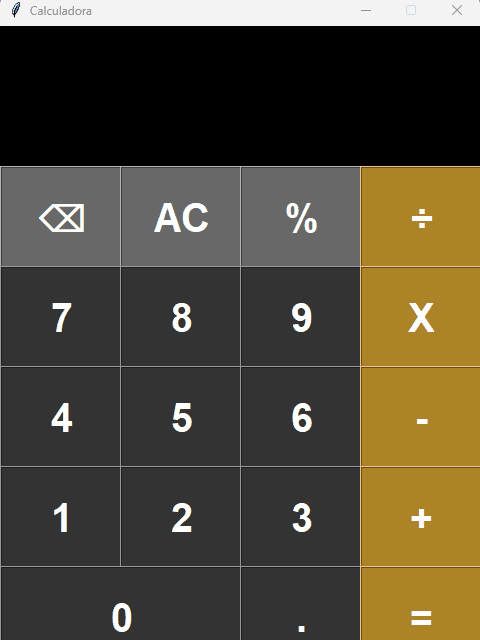

# 🧮 Calculadora GUI - Python & Tkinter

Uma calculadora de mesa funcional e responsiva construída inteiramente com Python. O projeto apresenta uma interface gráfica de usuário (GUI) moderna com tema escuro, inspirada no design clássico de calculadoras mobile.



## 🚀 O Problema que Resolve
Este projeto foi desenvolvido como uma aplicação prática para estudar o desenvolvimento de interfaces gráficas em Python usando a biblioteca padrão. Ele resolve cálculos matemáticos cotidianos com uma interface amigável, substituindo o uso do terminal por uma janela executável de fácil interação.

## ✨ Funcionalidades (Features)
* **Operações Básicas:** Suporte a adição (+), subtração (-), multiplicação (X) e divisão (÷).
* **Tratamento de Erros:** O sistema captura exceções matemáticas (como divisão por zero ou sintaxe inválida) e exibe um aviso de "Erro" na tela de forma amigável.
* **Controle de Caracteres:** A tela possui um limite inteligente de 12 caracteres para evitar transbordamento de texto no display.
* **Correção Rápida:** Botão de *Backspace* (⌫) para apagar o último dígito inserido e *All Clear* (AC) para limpar todo o histórico atual[cite: 2].
* **Design Moderno:** Interface de tamanho fixo (480x640) não-redimensionável, garantindo que o layout dos botões e do display nunca quebre[cite: 2].

## 🛠️ Tecnologias Utilizadas
* **Python 3.x:** Linguagem base.
* **Tkinter (Built-in):** Biblioteca gráfica padrão do Python utilizada para a renderização das janelas, frames e botões[cite: 2].

## ⚙️ Como Executar o Projeto

**1. Clone o repositório:**
```bash
git clone https://github.com/uemuralc/Calculadora-TKinter
cd Calculadora-Tkinter
```

2. Execute a aplicação:

```Bash
python Calculadora.py
```

## 🏗️ Arquitetura e Engenharia de Código

**O desenvolvimento desta calculadora aplicou conceitos interessantes de estruturação gráfica:**

* **Gerenciamento** de Estado: Uma variável global (expressao) atua como a única fonte da verdade, armazenando a string da conta e atualizando a interface Label a cada interação.

* **Motor de Cálculo:** Utiliza a função built-in eval() envolvida em um bloco try/except para converter a string formatada em operações matemáticas reais de forma dinâmica.

* **Pixel Perfect (Trick):** Para garantir que os botões respeitassem larguras e alturas exatas em pixels (em vez de em unidades de texto padrão do Tkinter), foi implementado um "hack" de renderização usando uma imagem transparente de 1x1 pixel.
